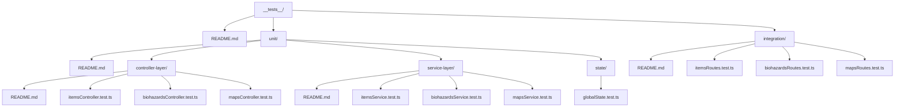

# Testing Guide

> **Purpose**: Comprehensive testing documentation for the RE Remake Interactive Map project.

## Table of Contents

- [Overview](#overview)
- [Testing Philosophy](#testing-philosophy)
- [Test Structure](#test-structure)
- [Unit Tests](#unit-tests)
- [Integration Tests](#integration-tests)
- [Running Tests](#running-tests)
- [Writing New Tests](#writing-new-tests)
- [Known Issues](#known-issues)

## Overview

The testing strategy follows 2025 industry best practices with a clear separation between unit and integration tests. All tests are written in TypeScript using Jest and Supertest.

### Key Principles

- **Unit Tests**: Isolate individual layers (service for business logic, controller for HTTP handling)
- **Integration Tests**: Test full stack (routes → controllers → services → middleware)
- **Coverage Target**: 80%+ code coverage
- **Type Safety**: Full TypeScript integration with ts-jest
- **Fast Execution**: Unit tests run in milliseconds, integration tests in seconds

## Testing Philosophy

### From `src/__tests__/README.md`

The testing approach is built on several core principles:

1. **Isolation**: Each unit test targets a single layer, mocking dependencies
2. **Coverage**: Focus on happy paths, edge cases, and errors
3. **Error Handling**: Test success paths, partial success, and errors
4. **TypeScript Integration**: Type-safe tests with ts-jest
5. **Dependencies**: Jest for assertions/mocking, Supertest for HTTP simulation

### API Features Reflected in Tests

- **Batch Operations**: Fetching by ID or code returns structured responses
- **Structured Responses**: `{ foundResources, unrecognizedIds }` or `{ foundRankings, unrecognizedCodes }`
- **Error Handling**: Services throw NotFoundError, BadRequestError for invalid inputs
- **Validation**: Input validation at route level before controller
- **Rate Limiting**: 100 requests per 15 minutes (tested manually, not in Jest)

## Test Structure

```
src/__tests__/
├── README.md                    # Main testing documentation
├── unit/                        # Unit tests (isolated components)
│   ├── README.md                # Unit testing overview
│   ├── controller-layer/        # Controller tests (HTTP handling)
│   │   ├── README.md            # Controller testing guide
│   │   ├── itemsController.test.ts
│   │   ├── biohazardsController.test.ts
│   │   └── mapsController.test.ts
│   ├── service-layer/           # Service tests (business logic)
│   │   ├── README.md            # Service testing guide
│   │   ├── itemsService.test.ts
│   │   ├── biohazardsService.test.ts
│   │   └── mapsService.test.ts
│   └── state/                   # State management tests
│       └── globalState.test.ts
└── integration/                 # Integration tests (full stack)
    ├── README.md                # Integration testing guide
    ├── itemsRoutes.test.ts
    ├── biohazardsRoutes.test.ts
    └── mapsRoutes.test.ts
```

### File Organization



## Unit Tests

### Purpose

Unit tests focus on isolating and testing individual components in a controlled environment. They are fast, repeatable, and help catch issues early.

### Benefits

- **Quick Execution**: No full stack spin-up required
- **High Granularity**: Easy debugging of specific functions
- **Separation of Concerns**: Business logic vs HTTP handling
- **Loose Coupling**: Changes in one layer don't break other layer tests

### Service Layer Tests

**Location**: `src/__tests__/unit/service-layer/`

**What They Test**:
- Business logic and data operations
- Data filtering and validation
- Error generation (NotFoundError, BadRequestError)
- Edge cases (duplicates, empty inputs, large inputs)

**Dependencies**:
- Minimal - only internal data arrays
- No mocking required (services are the base layer)
- Use real data arrays for accuracy

**Example Pattern**:
```typescript
import { getItemsByIds } from '../../../api/services/itemsService';
import { NotFoundError, BadRequestError } from '../../../errors/customErrors';

describe('getItemsByIds', () => {
    it('should return found items for valid IDs', async () => {
        const result = await getItemsByIds(['validId1', 'validId2']);
        expect(result.foundResources).toHaveLength(2);
        expect(result.unrecognizedIds).toHaveLength(0);
    });

    it('should return unrecognized IDs for invalid IDs', async () => {
        const result = await getItemsByIds(['invalid1', 'invalid2']);
        expect(result.foundResources).toHaveLength(0);
        expect(result.unrecognizedIds).toEqual(['invalid1', 'invalid2']);
    });

    it('should throw BadRequestError for empty input', async () => {
        await expect(getItemsByIds([])).rejects.toThrow(BadRequestError);
    });

    it('should throw NotFoundError when no items found', async () => {
        await expect(getItemsByIds(['nonexistent'])).rejects.toThrow(NotFoundError);
    });
});
```

### Controller Layer Tests

**Location**: `src/__tests__/unit/controller-layer/`

**What They Test**:
- HTTP request/response logic
- Query parameter parsing
- Delegation to services
- Response formatting
- Error propagation to middleware

**Dependencies**:
- Mock service methods with jest.mock
- Simulate Express req/res objects

**Mocking Strategy**:
```typescript
import * as services from '../../../api/services/itemsService';

jest.mock('../../../api/services/itemsService');

describe('itemsController', () => {
    let mockRequest: Partial<Request>;
    let mockResponse: Partial<Response>;

    beforeEach(() => {
        mockRequest = {
            query: { ids: 'id1,id2' }
        };
        mockResponse = {
            json: jest.fn(),
            status: jest.fn().mockReturnThis()
        };
    });

    it('should call service with parsed IDs', async () => {
        (services.getItemsByIds as jest.Mock).mockResolvedValue({
            foundResources: [/* mock data */],
            unrecognizedIds: []
        });

        await getItems(mockRequest as Request, mockResponse as Response);

        expect(services.getItemsByIds).toHaveBeenCalledWith(['id1', 'id2']);
        expect(mockResponse.json).toHaveBeenCalled();
    });

    it('should handle NotFoundError with 404 status', async () => {
        (services.getItemsByIds as jest.Mock).mockRejectedValue(
            new NotFoundError('No items found')
        );

        await getItems(mockRequest as Request, mockResponse as Response);

        expect(mockResponse.status).toHaveBeenCalledWith(404);
    });
});
```

### State Tests

**Location**: `src/__tests__/unit/state/`

**What They Test**:
- Global state reactivity (Proxy behavior)
- Subscription mechanism (EventTarget)
- State updates and notifications
- Type safety of state properties

**Example**:
```typescript
import { globalState, subscribeState } from '../../../state/globalState';

describe('globalState', () => {
    it('should update state and notify subscribers', () => {
        const callback = jest.fn();
        subscribeState('roomId', callback);

        globalState.roomId = 'testRoom';

        expect(callback).toHaveBeenCalledWith('testRoom');
    });

    it('should handle multiple subscribers', () => {
        const callback1 = jest.fn();
        const callback2 = jest.fn();

        subscribeState('theme', callback1);
        subscribeState('theme', callback2);

        globalState.theme = 'nocturnal';

        expect(callback1).toHaveBeenCalledWith('nocturnal');
        expect(callback2).toHaveBeenCalledWith('nocturnal');
    });
});
```

## Integration Tests

### Purpose

Integration tests verify the full API stack, ensuring components work together seamlessly. They use Supertest to simulate real HTTP requests.

### Benefits

- **End-to-End Validation**: Tests entire request lifecycle
- **API Contract Verification**: Ensures endpoints return expected responses
- **Error Flow Testing**: Tests how errors propagate through layers
- **Real Service Data**: Uses actual data, not mocks

### What They Test

**Location**: `src/__tests__/integration/`

**Focus**:
- Full HTTP endpoints (GET `/api/items?ids=...`)
- Query parameter parsing
- Response status codes
- Response body structure
- Error handling (400, 404, 500)
- Partial success scenarios

**Example Pattern**:
```typescript
import request from 'supertest';
import express from 'express';
import itemsRouter from '../../api/routes/itemsRoutes';

describe('Items API Integration Tests', () => {
    let app: express.Application;

    beforeAll(() => {
        app = express();
        app.use('/api/items', itemsRouter);
    });

    describe('GET /api/items?ids=...', () => {
        it('should return 200 with found items', async () => {
            const response = await request(app)
                .get('/api/items?ids=validId1,validId2')
                .expect(200);

            expect(response.body).toHaveProperty('foundResources');
            expect(response.body.foundResources).toHaveLength(2);
        });

        it('should return 404 when no items found', async () => {
            const response = await request(app)
                .get('/api/items?ids=nonexistent')
                .expect(404);

            expect(response.body).toHaveProperty('error');
        });

        it('should return 400 for empty query', async () => {
            await request(app)
                .get('/api/items?ids=')
                .expect(400);
        });

        it('should handle partial matches with 200', async () => {
            const response = await request(app)
                .get('/api/items?ids=validId,invalidId')
                .expect(200);

            expect(response.body.foundResources).toHaveLength(1);
            expect(response.body.unrecognizedIds).toEqual(['invalidId']);
        });
    });
});
```

### Integration vs Unit Tests

| Aspect | Unit Tests | Integration Tests |
|--------|-----------|-------------------|
| **Scope** | Single function/method | Full request lifecycle |
| **Mocking** | Heavy (mock dependencies) | None (use real services) |
| **Speed** | Very fast (milliseconds) | Slower (seconds) |
| **What's Tested** | Logic isolation | Component interaction |
| **Tools** | Jest | Jest + Supertest |
| **When to Use** | Testing algorithms, validation | Testing API contracts |

## Running Tests

### Commands

```bash
# Run all tests
npm test

# Run tests in watch mode (re-run on file changes)
npm run test:watch

# Generate coverage report
npm run test:coverage
```

### Jest Configuration

From `jest.config.ts`:

```typescript
export default {
    preset: 'ts-jest',
    testEnvironment: 'node',
    roots: ['<rootDir>/src'],
    testMatch: ['**/__tests__/**/*.test.ts'],
    moduleNameMapper: {
        '^src/(.*)$': '<rootDir>/src/$1'
    },
    collectCoverageFrom: [
        'src/**/*.ts',
        '!src/**/*.test.ts',
        '!src/**/__tests__/**'
    ],
    coverageThresholds: {
        global: {
            branches: 80,
            functions: 80,
            lines: 80,
            statements: 80
        }
    }
};
```

### Coverage Reports

Coverage reports show:
- **Statements**: % of executable statements covered
- **Branches**: % of conditional branches covered
- **Functions**: % of functions called
- **Lines**: % of lines executed

**Target**: 80%+ across all metrics

## Writing New Tests

### Adding Service Tests

1. Create file in `src/__tests__/unit/service-layer/`
2. Import service functions
3. Test happy path, edge cases, errors
4. No mocking needed - use real data

**Template**:
```typescript
import { serviceFunction } from '../../../api/services/yourService';
import { NotFoundError, BadRequestError } from '../../../errors/customErrors';

describe('serviceFunction', () => {
    describe('Happy Path', () => {
        it('should return expected result for valid input', async () => {
            const result = await serviceFunction(validInput);
            expect(result).toBeDefined();
            // Add specific assertions
        });
    });

    describe('Edge Cases', () => {
        it('should handle empty input', async () => {
            await expect(serviceFunction([])).rejects.toThrow(BadRequestError);
        });

        it('should handle duplicate values', async () => {
            const result = await serviceFunction(['id1', 'id1']);
            // Assert deduplication behavior
        });
    });

    describe('Error Handling', () => {
        it('should throw NotFoundError when no results', async () => {
            await expect(serviceFunction(['invalid'])).rejects.toThrow(NotFoundError);
        });
    });
});
```

### Adding Controller Tests

1. Create file in `src/__tests__/unit/controller-layer/`
2. Mock service dependencies with `jest.mock`
3. Create mock req/res objects
4. Test HTTP-specific logic

**Template**:
```typescript
import { controllerFunction } from '../../../api/controllers/yourController';
import * as service from '../../../api/services/yourService';
import { Request, Response } from 'express';

jest.mock('../../../api/services/yourService');

describe('controllerFunction', () => {
    let mockReq: Partial<Request>;
    let mockRes: Partial<Response>;

    beforeEach(() => {
        mockReq = { query: {}, params: {} };
        mockRes = {
            json: jest.fn(),
            status: jest.fn().mockReturnThis()
        };
    });

    it('should parse request and call service', async () => {
        (service.serviceFunction as jest.Mock).mockResolvedValue(mockData);

        await controllerFunction(mockReq as Request, mockRes as Response);

        expect(service.serviceFunction).toHaveBeenCalledWith(expectedParams);
        expect(mockRes.json).toHaveBeenCalledWith(mockData);
    });

    it('should handle errors with appropriate status', async () => {
        (service.serviceFunction as jest.Mock).mockRejectedValue(new NotFoundError('Not found'));

        await controllerFunction(mockReq as Request, mockRes as Response);

        expect(mockRes.status).toHaveBeenCalledWith(404);
    });
});
```

### Adding Integration Tests

1. Create file in `src/__tests__/integration/`
2. Set up Express app with routes
3. Use Supertest for HTTP requests
4. Test full request/response cycle

**Template**:
```typescript
import request from 'supertest';
import express from 'express';
import router from '../../api/routes/yourRoutes';

describe('Your API Integration Tests', () => {
    let app: express.Application;

    beforeAll(() => {
        app = express();
        app.use('/api/your-resource', router);
    });

    describe('GET /api/your-resource', () => {
        it('should return 200 with data', async () => {
            const response = await request(app)
                .get('/api/your-resource?param=value')
                .expect(200);

            expect(response.body).toHaveProperty('expectedProperty');
        });

        it('should return 400 for invalid input', async () => {
            await request(app)
                .get('/api/your-resource?param=invalid')
                .expect(400);
        });
    });
});
```

## Known Issues

### Rate Limiting Tests

From `docs/rate-limiting-test-challenges.md`:

**Issue**: Rate limiting with `express-rate-limit` and `MemoryStore` cannot be reliably tested in Jest/Supertest due to:
- State persistence across tests
- Jest module hoisting causing scoping errors
- MemoryStore internal singleton-like behavior

**Solution**: Rate limiting tests have been removed from the suite. Rate limiting works in production and can be verified manually.

**Manual Testing**:
```javascript
// Run in browser console against http://localhost:3000
(async () => {
    for (let i = 0; i < 101; i++) {
        const response = await fetch('http://localhost:3000/api/items?ids=selfDefenseJV-keepersRoom');
        const status = response.status;
        const body = await response.json().catch(() => ({}));
        console.log(`Request ${i + 1}: Status ${status}`, body);
    }
})();
```

**Expected**: Request 101 returns 429 with `{"message":"Too many requests, please try again later."}`

### Future Improvements

1. **Frontend Tests**: Add tests for UI components and rendering logic
2. **E2E Tests**: Add Playwright/Cypress for browser testing
3. **Performance Tests**: Add benchmarks for large input arrays
4. **Database Migration**: When migrating from static data to DB, update service tests to mock DB calls
5. **Rate Limiting**: Consider Redis store for testable rate limiting

## Best Practices

### Test Naming

Use descriptive test names following this pattern:
```typescript
describe('Component/Function Name', () => {
    describe('Context/Method', () => {
        it('should [expected behavior] when [condition]', () => {
            // Test
        });
    });
});
```

### Assertions

Be specific with assertions:
```typescript
// ❌ Too vague
expect(result).toBeDefined();

// ✅ Specific
expect(result.foundResources).toHaveLength(2);
expect(result.foundResources[0]).toMatchObject({
    id: 'expectedId',
    name: 'Expected Name'
});
```

### Error Testing

Always test error paths:
```typescript
// Test happy path
it('should return data for valid input', async () => {
    const result = await serviceFunction(validInput);
    expect(result).toBeDefined();
});

// Test error path
it('should throw error for invalid input', async () => {
    await expect(serviceFunction(invalidInput)).rejects.toThrow(ExpectedError);
});
```

### Mock Cleanup

Clean up mocks between tests:
```typescript
beforeEach(() => {
    jest.clearAllMocks();
});

afterAll(() => {
    jest.restoreAllMocks();
});
```

### Type Safety

Leverage TypeScript in tests:
```typescript
import { ItemRoomData } from '../../../data/types';

const mockItem: ItemRoomData = {
    // TypeScript ensures all required properties are present
    id: 'test-id',
    map: { room: 'testRoom', map: 'testMap' },
    // ...
};
```

## Testing Checklist

When adding new features, ensure:

- [ ] Service layer has unit tests (happy path, edge cases, errors)
- [ ] Controller layer has unit tests (request parsing, service delegation, error handling)
- [ ] Integration tests cover the full endpoint
- [ ] All tests pass (`npm test`)
- [ ] Coverage remains above 80% (`npm run test:coverage`)
- [ ] Test names are descriptive
- [ ] Error paths are tested
- [ ] Type safety is maintained

---

**See Also**:
- [AI_CONTEXT.md](./AI_CONTEXT.md) - Main project context
- [CONTRIBUTING.md](../CONTRIBUTING.md) - Contributing guide with commit format
- `src/__tests__/README.md` - Additional testing details
- `docs/rate-limiting-test-challenges.md` - Rate limiting issues

**Last Updated**: 2025-10-25
