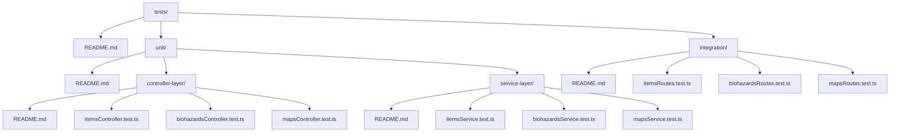

# Testing Documentation for the API

This documentation summarizes the testing strategy, structure, and implementation for the API, built with TypeScript and Express 5. The API manages multiple resource types (e.g., items, rooms, biohazards, S.T.A.R.S. rankings), with service and controller layers tested using Jest and Supertest. Tests are organized in the `tests` directory, following a structured approach for unit and integration testing.

The testing philosophy follows 2025 industry best practices (e.g., from DEV Community, Medium, and Jest docs):

- **Unit Tests**: Isolate individual layers (service for business logic, controller for HTTP handling) using mocks for fast, focused tests.
- **Integration Tests**: Test the full stack (routes → controllers → services → middleware) to verify end-to-end behavior.
- **Coverage**: Target 80%+ code coverage, enforced via `jest.config.ts`.
- **Error Handling**: Test success paths, partial success (e.g., unrecognized IDs/codes in batch operations), and errors (e.g., `NotFoundError`, `BadRequestError`).
- **TypeScript Integration**: Tests use type safety with `ts-jest`.
- **Dependencies**: Jest for assertions/mocking, Supertest for HTTP simulation.

Key API Features Reflected in Tests:

- Data is stored as arrays of resource objects (e.g., items, rooms, biohazards, stars rankings).
- Fetching supports batch operations by ID or code, returning objects with found resources/rankings and unrecognized IDs/codes.
- Services return structured responses (e.g., `{ foundResources, unrecognizedIds }` or `{ foundRankings, unrecognizedCodes }`) and throw errors for invalid inputs.
- Controllers parse query parameters (e.g., comma-separated IDs or codes) and handle responses/errors via middleware.
- Routes: Support GET endpoints (e.g., `/api/resources?ids=id1,id2`) for batch fetching.

## Tests Folder Structure

Below is the folder structure for the test suite, visualized using a Mermaid diagram for clarity.

